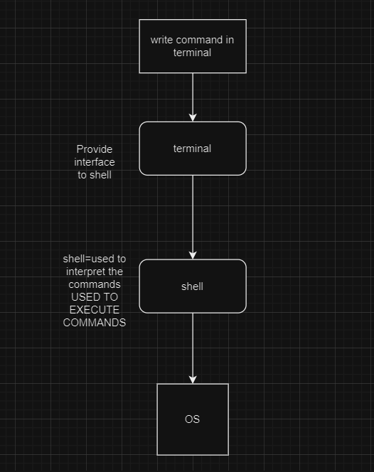

1. SHELL TERMINAL CMD

# Set your terminal according to the needs of DevOps
1. Install or Upadte Windows Terminal
 > update/install link:[link to windows terminal](https://apps.microsoft.com/detail/9n0dx20hk701?hl=en-us&gl=US)
 2. Install Linux on windows with WSL(windows subsystem for linux)
 1. Click of windows icon -> go to turn windows feature on or off -> Scroll down to windows subsystem for linux ->check the box->Scroll down to Hyper-V ->check the box->Click ok->restart system
 2. Go to powershell -> write wsl --install -> chose the desired distribution by running wsl --install -d Distributor_name->hit enter-> do an update wsl --update
 3. Go to search icon on task manager search your Distributor_name and click on that -> There you have your linux on windows

 >Link to check the above process [Install WSL command](https://learn.microsoft.com/en-us/windows/wsl/install)

Windows powershell is advance version of comand promt
Powershell= can execute all task of a command promt [but vice versa is not applicable]
terminal= emulator=let us use the terminal in grapical way
shell= CLI interpert the commands and tells OS what to do
command promt=part of terminal

[OR]

you can use a virtual box to crreate a linux os of your desire flavour and run the commands there 
>NOTE: Linux comes in with default bash you can use more advance zsh in place of bash shell

# Commands

 1. ls command and it's variations
    - ls -a
    - ls -l
    - ls -R

 2. cat
 3. echo
 4. man
 5. tr
 6. touch
 7. cp
    - cp -R
 8. mv
    - mv -R
 9. rm
    - rm -R
10. sudo
11. df
12. du
13. tail
14. diff
15. locate
16. find
17. permision: read write execute
18. chmod {hard}
19. chown
20. grep
21. history
22. alias
23. sort
24. jobs
25. ping
26. wget
27. top
28. uname
29. zip
30. uzip
31. hostname
32. useradd
33. userdel
34. lscpu
35. free
36. umstat
37. id
38. getent
39. lsof
40. nslookup
41. sed
42. cut
43. htop
44. operators: &&,||,!,>>(append),>(override)
